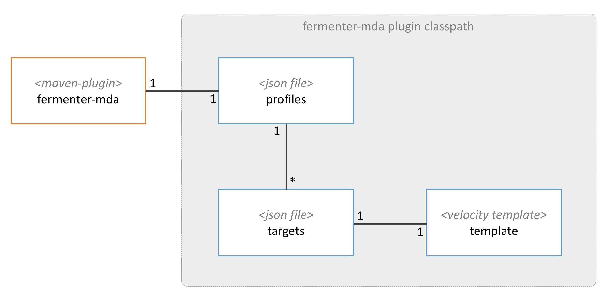

# Fermenter #
[](https://search.maven.org/#search%7Cgav%7C1%7Cg%3A%22org.technologybrewery.fermenter%22%20AND%20a%3A%22root%22)
[](https://opensource.org/licenses/mit)
[](https://github.com/TechnologyBrewery/fermenter/actions/workflows/maven.yaml)

In brewing, a fermenter is a vessel in which unfinished ingredients become nearly finished beer. In Model Driven 
Architecture, Fermenter is a project that converts functional concepts into nearly finished applications. This approach
allows for the quick definition and assembly of applications with the focus on functional concepts rather than technical 
underpinnings.

## Approach ##
The Fermenter approach is simple - it is solely intended to generate source code based on simple, developer targeted 
model. This is the key difference between Fermenter and other MDA tools and approaches is that it puts a premium on 
developer productivity rather than architectural concepts or diagrams.


### Step 1 - Define Your Model & Select a Framework ###
To get started, you define the model elements you need and select a framework to use. The model describes what business 
concepts you need in your application. Fermenter can model entities, services, composites, or enumerations. The 
framework can be anything you'd like (e.g., JEE, Spring, something home grown or legacy).

### Step 2 - Run Fermenter ###
Add our Maven plugin to your build and run your build like you normally do.

### Step 3 - Update Generated Source with Business Logic ###
Fermenter will generate source into the folder structure appropriate for the type of project being generated (i.e. 
`src/generated/<appropriate sub-folder>` for Java-based projects), representing the concepts and framework you have 
configured.  Update modifiable stubs with business logic, which are similarly generated into the appropriate location 
(i.e. `src/main/<appropriate sub-folder>` for Java-based projects) and you're done!

# Existing Fermenter Frameworks
Please see [Fermenter Legacy Frameworks](https://github.com/TechnologyBrewery/fermenter-legacy-frameworks) for existing options.  

# Controlling What Gets Generated
`fermenter-mda` allows you to convert simple JSON model files into source code.  The process is highly configurable 
through the steps outlined below.  For real examples, please see `stout-spring-mda` and `stout-cookbook`.



## Using the `fermenter-mda` plugin
To run `fermenter-mda`, you add the Maven plugin to your POM file and add in your desired configuration parameters.  
The plugin exposes two goals:
- Code generation during the `generate-sources` phase of your build
- Clean out generated source files during the `clean` phase of your build

We'll walk through the following example to hook up generation while understanding how to control exactly what gets generated.

```xml
<plugin>
    <groupId>org.technologybrewery.fermenter</groupId>
    <artifactId>fermenter-mda</artifactId>
    <version>2.10.0</version>    
    <configuration>
        <basePackage>org.technologybrewery.generation.example</basePackage>
        <profile>domain</profile>
    </configuration>
    <executions>
        <execution>
            <id>generate-sources</id>
            <phase>generate-sources</phase>
            <goals>
                <goal>generate-sources</goal>
            </goals>
        </execution>
        <execution>
            <id>clean</id>
            <phase>clean</phase>
            <goals>
                <goal>clean</goal>
            </goals>
        </execution>
    </executions>
    <dependencies>
        <dependency>
            <groupId>org.technologybrewery.fermenter.stout</groupId>
            <artifactId>stout-spring-mda</artifactId>
            <version>2.9.0</version>
        </dependency>
    </dependencies>
</plugin>
```

## `fermenter-mda` Plugin Configuration Options
The following options can be added to your plugin's `configuration` block.

### `basePackage`
Passes a namespace into the generator that is used to differentiate generated files. For instance, it is often used to 
create a base package when generating Java files on top of which other values may be added 
(e.g., `package base.package.value.somesubpackage`) or as an XML namespace.

*NOTE:* If the target project being generated is a Java-based project, which is specified via the language plugin 
configuration, basePackage is required. If the target project being generated is a Python-based project, which is 
specified by either the `language` plugin configuration or using the [Habushu](https://github.com/TechnologyBrewery/habushu) 
Maven lifecycle, the `basePackage` will be automatically inferred, but may be manually provided.

**Required:** if `language` is `java`, otherwise optional

**Default:** none

### `profile`
The name of the profile that will be loaded and executed by the generator.

**Required:** true

**Default:** none

### `metadataDependencies`
Allows other maven artifacts that contain metadata files to be pulled into the generator when they do not directly live 
in your current Maven module. An example of this is provided in a subsequent section.

**Required:** false

**Default:** none

### `targetModelInstances`
When specified and used in conjunction with a target that has a `metadataContext` of `targeted`, allows only the 
metadata in the `artifactId`s listed within `targetModelInstances` to be passed to the target in question. If not 
specified, it becomes equivalent to a `metadataContext` of `local`.

**Required:** false

**Default:** The current `artifactId` if no `targetModelInstances` are specified

### `mainSourceRoot`
Controls what output directory is used for generated sources that are intended to be placeholder stubs in which 
developers are expected to manually update with business logic.

**Required:** false

**Default:** `${project.basedir}/src/main` (overridden automatically in Python modules using Habushu)

### `generatedSourceRoot`
Controls what output directory is used for generated sources that are expected to be repeatably generated and 
overwritten after each Maven build. 

*NOTE:* Directory WILL be wiped out during each build (via the `clean` goal in `fermenter-mda`) to ensure that no 
generated code if being directly modified, so care should be taken when changing this to avoid accidentally deleting 
non-generated code.

**Required:** false

**Default:** `${project.basedir}/src/generated` (overridden automatically in Python modules using Habushu)

### `testSourceRoot`
Controls the output directory for generated test sources that are intended to be placeholder stubs in which developers 
are expected to manually update with appropriate automated test logic. This configuration is typically used when a 
generation `target` has an `artifactType` of `test`.

**Required:** false

**Default:** `${project.basedir}/src/test` (overridden automatically in Python modules using Habushu)

### `generatedTestSourceRoot`
Controls what output directory is used for generated test sources that are expected to be repeatably generated and 
overwritten after each Maven build. This configuration is typically used when a generation `target` has an `artifactType` 
of `test`.

*NOTE:* Directory WILL be wiped out during each build (via the `clean` goal in `fermenter-mda`) to ensure that no 
generated code if being directly modified, so care should be taken when changing this to avoid accidentally deleting 
non-generated code.

**Required:** false

**Default:** `${project.basedir}/src/generated-test` (overridden automatically in Python modules using Habushu)

### `language`
Specifies the language of the target project being generated. The various properties that control where generated code 
is placed (i.e. `mainSourceRoot`, `generatedSourceRoot`, `testSourceRoot`, and `generatedTestSourceRoot`) will be 
automatically set based on the specified language.

Valid options include:
- `java`
- `python`

*NOTE:* Directory WILL be wiped out during each build (via the `clean` goal in `fermenter-mda`) to ensure that no
generated code if being directly modified, so care should be taken when changing this to avoid accidentally deleting
non-generated code.

**Required:** false

**Default:** `java` (overridden automatically to `python` in modules using Habushu 2.0.0 or higher)

### `localMetadataRoot`
Location from which local metadata definitions will be loaded

**Required:** false

**Default:** `${mainSourceRoot}/resources`

### `metadataRespositoryImpl`
Allows you to substitute a different implementation of the `MetadataRepository` that controls what metadata is 
available to the generator. MUST have a no argument constructor.

**Required:** false

**Default:** `org.technologybrewery.fermenter.mda.metadata.MetadataRepository`

### `localTypes`
Allows the addition of local types within you current project.

**Required:** false

**Default:** `${project.basedir}/src/main/resources/types.json`

## Creating and specifying a `profile`
Profiles represent a collection of targets that will be used to generate source in a given execution of the 
`fermenter-mda` plugin. Targets will be discussed in more detail in the next section, but in short they control how a 
specific file is generated. Profiles must contain at least one target. They can also reference other profiles to 
build "uber profiles" via composition. You only need to create a profile if there isn't one that  already suites 
your needs. In other words, profiles represent logical groupings of targets that when processed by the 
`fermenter-mda` plugin, generate source code that aligns with architectural patterns or concepts. For example, the 
`profiles.json` definition in `stout-spring-mda` contains a `business-objects-and-services` profile, which aggregates 
all targets that  must be processed by the `fermenter-mda` plugin to correctly generate business objects and services 
for the given metamodels.
```json
[
    {
        "name": "simple-profile-a",
        "targetReferences": [
            {
            "name": "some-target"
            },
            {
                "name": "some-other-target"
            }]
     },
     {
        "name": "simple-profile-b",
        "targetReferences": [
            {
                "name": "another-target"
            }]
     },
     {
        "name": "simple-profile-c",
        "deprecated": "true",
        "warningMessage": "This profile is deprecated, please use 'simple-profile-b' instead."
     },
     {
        "name": "uber-profile",
        "profileReferences": [
            {
                "name": "simple-profile-a"
            },
            {
                "name": "simple-profile-b"
            }],
        "targetReferences": [
            {
                "name": "one-more-target"
            }]
     }
]
```
Specifying a profile is very simple.  The above example contains all the possible configuration options. Detailed notes
on each option is defined below.

### `name`
Defines the name of the profile.

**Required:** true

**List:** false

### `targetReferences`
Specifies a list of target names to be included in the containing profile.

**Required:** false

**List:** true

### `targetReferences/name`
The name of a target that exists in a `targets.json` file.

**Required:** true

**List:** false

### `profileReferences`
Specifies a list of other profile names to be included in the containing profile.

**Required:** false

**List:** true

### `profileReferences/name`
The name of a profile that exists in a `profiles.json` file.

**Required:** true

**List:** false

### `deprecated`
Boolean for whether a profile is deprecated and should no longer be used.

**Required:** false

**List:** false

**Default:** false

### `warningMessage`
Optional warning message to be displayed when a deprecated profile is used.

**Required:** false

**List:** false

### Deprecation Support Note
Profiles marked as deprecated take advantage of the Java class `PriorityMessage` and the associated 
`PriorityMessageService` Java class for replaying the deprecation warnings at the end of the build. To take advantage of 
this functionality in other areas, the following snippet can be adapted to your needs:
```java
new PriorityMessageService().addPriorityMessage(new PriorityMessage("This message will be replayed"))
```
This functionality should be used sparingly to avoid having excessive warnings after each build.

## Creating and specifying a `target`
`target`s control how specific artifacts are generated. They represent a cross-section between metadata and output 
templates. More concretely, a `target` typically aligns with the generation of one or more artifact files - the specified 
generator is responsible for managing the cardinality of the generated artifacts, as well as collecting needed 
information from metamodels and applying it to the specified Velocity template during artifact generation.
```json
[
    {
        "name": "dataAccessRepositories",
        "templateName": "templates/repository.java.vm",
        "outputFile": "${basePackage}/persist/${entityName}Repository.java",
        "generator": "org.technologybrewery.fermenter.stout.mda.generator.entity.PersistentEntityJavaGenerator",
        "metadataContext": "local",
        "overwritable": false
    },
    ...
]
```
`target`s are also very easy to define with the above example highlighting all possible attributes. Detailed notes
on each option is defined below.

### `name`
The name of the target.  MUST be unique.

**Required:** true

### `templateName`
The name of the Velocity template that will be used to generate the output file

**Required:** true

### `outputFile`
The name of the output file. Several placeholder values can be used in this value:
- `${basePackage}`: inserts the `basePackage` value that is configured in the `fermenter-mda` plugin, replacing `.` with a path separator
- `${entityName}`: the name of the entity being generated (for Entity generators only)
- `${serviceName}`: the name of the service being generated (for Service generators only)
- `${enumerationName}`: the name of the enumeration being generated (for Enumeration generators only)
- `${artifactId}`: the `artifactId` with the standard `-` based Maven naming pattern refactored to camelCase (e.g., `foo-bar` → `fooBar`)

**Required:** true

### `generator`
The name of the class that will drive the merging of metadata with Velocity templates.  These are discussed in more detail in the next section.

**Required:** true

### `metadataContext`
Allows controls of the generator to support different subsets of metadata within a single generator instance. By 
default, three options are provided, but any value can be supported via a custom generator. The three defaults are:
- `local`: only generate metadata that originates in the current project
- `all`: generate metadata regardless of where it originates (i.e., local project or remote dependency). If not specified, the value is defaulted to all.
- `targeted`: generate metadata that resides in the `artifactId`s listed in `targetModelInstances`

**Required:** false

### `overwritable`

Whether or not to write the file if it is found to already exist. For instance, when generating files into the 
main source directory, you typically do not want to overwrite a file if it already exists because these files 
represents stubbed version where custom code is anticipated. Alternatively, when generating to an overwritable 
location, we assume that you want to update it in all cases, wiping out any customization that may have been made. 
This value determines the main vs. generated decision in listed in the `destination` attribute describing Generators 
below.

**Required:** true

### `artifactType`
If set to `test`, it will allow code to be generated into the configured `testSourceRoot` (i.e. `src/test`) or 
`generatedTestSourceRoot` (i.e. `src/generated-test`), as appropriate. Could also be extended in a custom Generator 
to provide additional options other than `src/main`, `src/generated`, `src/test`, or `src/generated-test`.

**Required:** false

## Generators that are available out of the box in `fermenter-mda`
There are many different generators that come out of the box. In addition, you can add your own by implementing 
`org.technologybrewery.fermenter.mda.generator.Generator`, with the following patterns likely proving using in the
creation of your custom generators. The default generators are described below:

### Entity Generators
The following generators handle common generation needs for entity metamodels.  All write to `src/{main/generated}/java`.

#### `EntityJavaGenerator` (Output: 1 file per entity)
Separately pull each entity and then merge it into the specified template. Wraps each entity in a `JavaEntity` decorator 
to ease the generation of Java files.

#### `AllEntitiesAwareJavaGenerator` (Output: 1 file)
Pull a list of all entities and then merge the list into the specified template. Wraps each entity in a `JavaEntity` 
decorator.

#### `PersistentEntityJavaGenerator` (Output: 1 file per _persistent_ entity)
Separately pull each persistent (i.e., where then entity has `"persistent": true`) entity and then merge it into 
the specified template.  Wraps each entity in a `JavaEntity` decorator.

### Enumeration Generators
The following generators handle common generation needs for enumeration metamodels.  All write to 
`src/{main/generated}/java`.

#### `EnumerationJavaGenerator` (Output: 1 file per enumeration)
Separately pull each enumeration and then merge it into the specified template. Wraps each entity in a 
`JavaEnumeration` decorator.

### Message Generators
The following generators handle common generation needs for message metamodels.  All write to
`src/{main/generated}/resources`.

#### `MessageResourceGenerator` (Output: 1 file)
Pull a list of all messages and then merge the list into the specified template.

### General Generators
The following generators handle general generation needs. 

#### `ModelAgnosticJavaGenerator` (Output: 1 file; Destination: `src/{main/generated}/java`)
Only pulls in the `basePackage` and `artifactId` and merges that data into the specified template.

#### `ModelAgnosticResourceGenerator` (Output: 1 file; Destination: `src/{main/generated}/resource`)
Only pulls in the `basePackage` and `artifactId` and merges that data into the specified template.

#### `AppConfigGenerator` (Output: 1 file; Destination: `src/{main/generated}/java`)
Pull a list of all entities and all services and then merges the lists into the specified template.  Wraps each 
entity in a `JavaEntity` decorator and each service in a `JavaService` decorator.

#### `WebappResourceGenerator` (Output: 1 file; Destination: `src/{main/generated}/webapp`)
Only pulls in the `basePackage` and `artifactId` and merges that data into the specified template.

### Service Generators
The following generators handle common generation needs for service metamodels.  All write to
`src/{main/generated}/java`.

#### `ServiceJavaGenerator` (Output: 1 file per service)
Separately pull each service and then merge it into the specified template. Wraps each entity in a `JavaService` 
decorator.

## Advanced Configuration of the `fermenter-mda` plugin
This section covers advanced configurations of the `fermenter-mda` plugin.

### Using metadata outside of your current Maven module
The standard use case for fermenter MDA is to generate code based on metadata that lives directly in the project. 
However, it is often useful to blend metadata across projects to create more complex, distributed solutions. Fermenter 
supports this by allowing you to declare `metadataDependencies` and `targetModelInstances` within the plugin. You 
simply add the appropriate `artifactId` as a `metadataDependency` and the metadata will be loaded by fermenter-mda. For 
more than one dependency, add multiple `metadataDependency` lines. The same is true for `targetModelInstances`. The 
difference is that `metadataDependencies` allows the generator to load referenced metadata while `targetModelInstances`
passes just the listed `artifactId`s to targets that use a `metadataContext` of `targeted`.  Targets that use a 
`metadataContext` of `all` will continue to generate for all metadata provided in the `metadataDependencies` tag.  As 
seen below, the key is to add the dependency configuration in the plugin and then ensure that the jar containing that 
metadata is in the plugin's classpath. When leveraging this feature, you will mostly likely need to set up more complex 
project structures to support cross-project generation (e.g., in stout, you must blend a rest client (or at least 
transfer objects) into a project that uses external metadata).

Currently, remote entities can be referenced by the following:
- As parameter inputs to service operations
- As the result of service operations
- Many more options coming soon (e.g., enumerations, references within entities)
```xml
<plugin>
    <groupId>org.technologybrewery.fermenter</groupId>
    <artifactId>fermenter-mda</artifactId>
    <version>2.10.0</version>
    <configuration>
        <basePackage>org.technologybrewery.fermenter.cookbook.referencing.domain</basePackage>
        <profile>rest-client</profile>
        <metadataDependencies>
			<metadataDependency>stout-cookbook-domain</metadataDependency>
            <metadataDependency>stout-cookbook-referencing-domain</metadataDependency>
        </metadataDependencies>
        <targetModelInstances>
            <targetModelInstance>stout-cookbook-referencing-domain</targetModelInstance>
        </targetModelInstances>
    </configuration>
    <dependencies>
        <dependency>
            <groupId>org.technologybrewery.fermenter.stout</groupId>
            <artifactId>stout-cookbook-domain</artifactId>
            <version>2.9.0</version>
        </dependency>
        <dependency>
            <groupId>org.technologybrewery.fermenter.stout</groupId>
            <artifactId>stout-cookbook-referencing-domain</artifactId>
            <version>2.9.0</version>
        </dependency>
        <dependency>
            <groupId>org.technologybrewery.fermenter.stout</groupId>
            <artifactId>stout-spring-mda</artifactId>
            <version>2.9.0</version>
        </dependency>
    </dependencies>
</plugin>
```

# Distribution Channel
Want Fermenter in your project? Add the following Maven plugin declaration and dependency to your project from Maven 
Central:

```xml
<properties>
	<fermenter.version>LATEST FERMENTER VERSION HERE (e.g., 2.10.0)</fermenter.version>
</properties>
<build>
	<plugins>
		<plugin>
			<groupId>org.technologybrewery.fermenter</groupId>
			<artifactId>fermenter-mda</artifactId>
			<version>${fermenter.version}</version>
			<configuration>
				<basePackage>com.your.domain.model</basePackage>
				<profile>your-domain-model</profile>
			</configuration>
			<dependencies>
				<dependency>
					<groupId>com.your.domain.model</groupId>
					<artifactId>your-fermenter-profile-name</artifactId>						
					<version>${project.version}</version>
				</dependency>		
			</dependencies>
		</plugin>
	</plugins>
</build>
...
<dependency>
    <!-- This is just an example using the Fermenter Stout Legacy framework: -->
    <groupId>org.technologybrewery.fermenter</groupId>
    <artifactId>stout-spring</artifactId>
    <version>${fermenter.version}</version>
</dependency>
```

## Releasing to Maven Central Repository
Fermenter uses both the `maven-release-plugin` and the `nexus-staging-maven-plugin` to facilitate the release and 
deployment of new Fermenter builds. In order to perform a release, you must:

1. Obtain a [JIRA](https://issues.sonatype.org/secure/Dashboard.jspa) account with Sonatype OSSRH and access to the `org.technologybrewery` project group

2. Ensure that your Sonatype OSSRH JIRA account credentials are specified in your `settings.xml`:

```xml
<settings>
  <servers>
    <server>
      <id>ossrh</id>
      <username>your-jira-id</username>
      <password>your-jira-pwd</password>
    </server>
  </servers>
</settings>
```

3. Install `gpg` and distribute your key pair - see [here](http://central.sonatype.org/pages/working-with-pgp-signatures.html).  OS X users may need to execute:

```bash
export GPG_TTY=`tty`;
```

4. Execute `mvn release:clean release:prepare`, answer the prompts for the versions and tags, and perform `mvn release:perform`

## Licensing
Fermenter is available under the [MIT License](http://opensource.org/licenses/mit-license.php).
